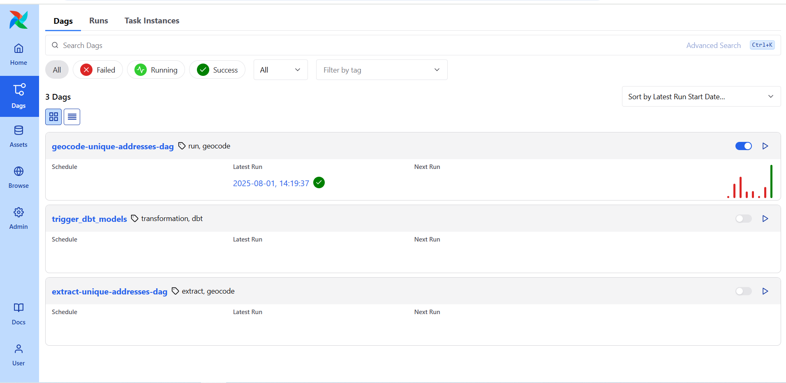
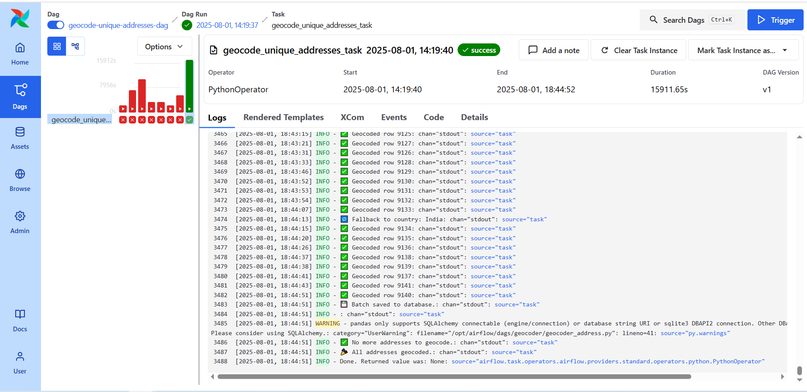
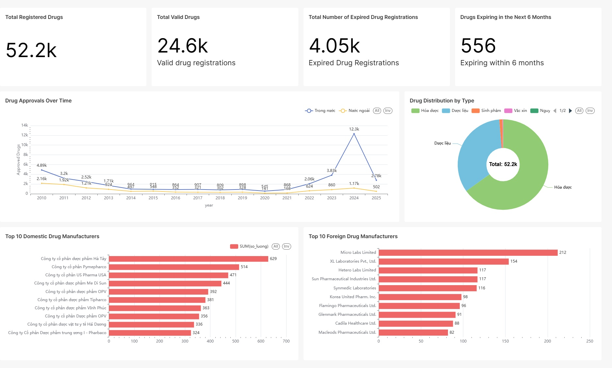
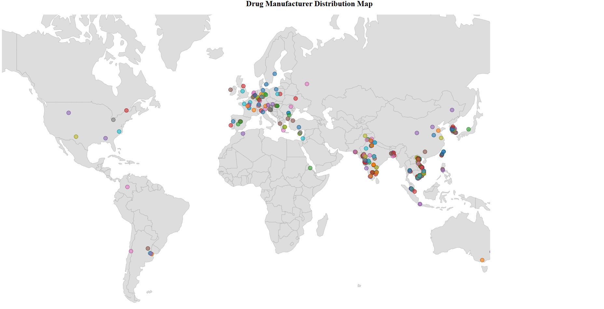

# 🇻🇳 VN-Drugs-Analytics
VN-Drugs-Analytics is an end-to-end data analytics pipeline for pharmaceutical registrations in Vietnam. The project utilizes Airflow, PostgreSQL, dbt, and Apache Superset to:

Schedule and automate data extraction and transformation tasks.

Enrich data by geocoding manufacturing addresses (adding latitude & longitude).

Perform analytical queries using dbt models.

Visualize insights on Superset dashboards.

## 🏗️ System Architecture

```
PostgreSQL <-> Airflow (ETL + Geocoding) <-> dbt (Data Modeling) <-> Superset (Visualization)
```

## 🧱 Project Structure

```
.
├── airflow/dags/                    # Airflow DAGs for data extraction & geocoding
│   └── geocoder/                    # Address extraction and geocoding utilities
├── dbt/                             # dbt configuration & logs
├── my_project/                      # Main dbt project
│   ├── models/
│   │   └── mart/                    # Final queries used in Superset dashboards
│   │       ├── drugs_per_year.sql
│   │       ├── expired_soon_drugs.sql
│   │       └── top_manufacturers.sql
├── docker/                          # Docker init scripts for each service
├── postgres/                        # SQL scripts to initialize PostgreSQL
├── docker-compose.yml              # Orchestrates all containers
├── requirements.txt                # Python dependencies
└── README.md                       # Project documentation
```
## 🔧 Key Components
### 1. PostgreSQL
Stores raw and processed pharmaceutical data.

Contains results after geocoding manufacturing addresses.

### 2. Apache Airflow
DAGs include:

extract_unique_addresses_dag.py: Extract unique manufacturing addresses.

geocode_unique_addresses_dag.py: Enrich addresses with geolocation data.

trigger_dbt_dag.py: Run dbt models after data preparation is complete.






### 3. dbt
Used for data transformation and modeling.

Key models:

drugs_per_year.sql: Counts number of approved drugs by year.

expired_soon_drugs.sql: Detects drugs nearing expiration.

top_manufacturers.sql: Identifies top manufacturing companies.

### 4. Apache Superset
Connects to PostgreSQL to build interactive dashboards.

Supports maps, bar charts, big number summaries, and more.

## ▶️ Running the Project with Docker

### Step 1: Build and launch the project
```
docker-compose up --build
```

### Step 2: Access services
-  Airflow UI: http://localhost:8080 
-  Superset UI: http://localhost:8088 (user: admin / password: admin)

## 📊 Example Dashboards in Superset
Geographic map of drug manufacturers using lat/lng data.

Drug registration trends over the years.

Top manufacturers by number of products.

Drugs expiring soon for regulatory monitoring.
...


Drug Manufacturer Distribution Map (custom-built)
Superset requires integration with a GeoMap API to render interactive maps. However, since no API key was available, the distribution map of drug manufacturers was built separately using Node.js (for the backend API) and React.js with D3.js (for the frontend visualization). The image below represents the geographical locations of pharmaceutical manufacturers in Vietnam based on geocoded address data.

github:https://github.com/DiuNH1710/geo-map



## 📦 Requirements
Docker & Docker Compose

(Optional) Python 3.8+ if running scripts locally

Required Python packages:

geopy, psycopg2, pandas, sqlalchemy, dbt-core, apache-airflow

## 👤 Author
Diu Nguyen
Fresher Data Engineer / Full Stack Developer


